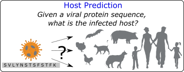

# VirProBERT: Language Model for Virus Host Prediction



## Repository Organization
- **deployment**
  - arc: shell scripts for deployments in arc
  - pandemic-da: shell scripts for deployments in pandemic-da
- **input**: 
    - config-files: yaml config files for data-preprocessing, prediction, and evaluation tasks.
    - data: raw fasta files of protein sequences and five independent splits with training and testing files
      - HEV virus protein sequences downloaded from
      - all mammalian and aves virus protein sequences download from UniRef90.
  raw: Folder containing raw protein sequences in fasta format. 
    - processed: Folder containing all preprocessed protein sequences with labels to be supplied as input to classification models.
- **output**: 
    - raw: Output files with predictions from the classification models.
    - evaluation: Intermediary output files with evaluation metric values generated by evaluation pipeline.
    - visualization: Result figures/visualizations.
    - logs: Log files generated during experiment executions.
- **src**: source code
---
## Data
Input protein sequence data used for all virus host prediction experiments are located at [input/data](input/data)

- [UniRef90](input/data/uniref90/20240131)
- [Coronaviridae Spike protein sequences](input/data/coronaviridae/20240313)
---
### Install Dependencies
Install python dependencies via 
```shell 
pip install -R ./requirements.txt
pip install numpy --pre torch --index-url https://download.pytorch.org/whl/cu117
pip install -r requirements.txt
pip install pyyaml
conda install pandas
```
### Create required folders
Create a directory for logs using - 
```shell
mkdir -p output/logs
```
### Setup Weights & Biases
1. Create an account in [Weights & Biases](https://wandb.ai/site/).
2. Create a new project in Weights and Biases named `zoonosis-host-prediction`.
3. Setup the `wandb` library by completing [Step 1 in the Quickstart](https://wandb.ai/quickstart?utm_source=app-resource-center&utm_medium=app&utm_term=quickstart).
    - Note: Do not forget to log in to Weights and Biases (`wandb login`) in the server where you intend to execute the experiment.
---
## Usage
```shell
python src/zoonosis.py -c <path-to-config-file>
```
Example
```shell
python src/zoonosis.py -c 
```
---
## Pipelines
The supported pipeline and their corresponding config type and sub-types are as follows -

| Pipeline                                           | Config Type                  | Config Sub-Type          | Example config                                                                                                                                                                                         |
|:---------------------------------------------------|:-----------------------------|:-------------------------|:-------------------------------------------------------------------------------------------------------------------------------------------------------------------------------------------------------|
| Masked Language Modeling                           | transfer_learning            | transfer_learning        | [uniref90-mlm-msl256.yaml](input/config-files/transfer_learning/masked_language_modeling/uniref90-mlm-msl256.yaml)                                                                                     |
| Virus Host Prediction - VirProBERT                 | transfer_learning            | host_prediction          | [uniref90-fine-tuning-host-prediction-multi.yaml](input/config-files/transfer_learning/fine_tuning/uniref90-fine-tuning-host-prediction-multi.yaml)                                                    |
| Virus Host Prediction - external pLMs              | transfer_learning            | host_prediction_external | [uniref90-fine-tuning-host-prediction-external-multi.yaml](input/config-files/transfer_learning/fine_tuning/uniref90-fine-tuning-host-prediction-external-multi.yaml)                                  |
| Virus Host Prediction - baseline models            | host_prediction              | -                        | [host-prediction-all-models.yaml](input/config-files/host_prediction/uniref90/embl/host-prediction-all-models.yaml)                                                                                    |
| Virus Host Prediction - kmer feature-based models  | host_prediction              | -                        | [engg-features-kmer-baseline.yaml](input/config-files/host_prediction/uniref90/embl/engg-features-kmer-baseline.yaml)                                                                                  |
| Virus Host Prediction - runtime                    | host_prediction_runtime      | -                        | [cov-s-host-prediction-multi-uniref90-sarscov2-variants.yaml](input/config-files/interpretability/sarscov2_variants/cov-s-host-prediction-multi-uniref90-sarscov2-variants.yaml)                       |
| Virus Host Prediction - runtime with external pLMs | host_prediction_runtime      | external                 | [cov-s-host-prediction-multi-uniref90-sarscov2-variants-external.yaml](input/config-files/interpretability/sarscov2_variants/cov-s-host-prediction-multi-uniref90-sarscov2-variants-external.yaml)     |
| Few Shot Learning - unseen and rare hosts          | few_shot_learning            | -                        | [uniref90-fine-tuning-host-prediction-non-idv-multi-few-shot-learning.yaml](input/config-files/few_shot_learning/novel_host/uniref90-fine-tuning-host-prediction-non-idv-multi-few-shot-learning.yaml) |
| Few Shot Learning - unseen viruses                 | few_shot_learning            | -                        | [uniref90-fine-tuning-host-prediction-idv-multi-few-shot-learning.yaml](input/config-files/few_shot_learning/novel_virus/uniref90-fine-tuning-host-prediction-idv-multi-few-shot-learning.yaml)        |
| Embedding generation - VirProBERT                  | embedding_generation         | -                        | [uniref90-fine-tuning-host-prediction-multi-embedding.yaml](input/config-files/interpretability/embedding/uniref90-fine-tuning-host-prediction-multi-embedding.yaml)                                   |
| Perturbation Analysis - VirProBERT                 | host_prediction_perturbation | -                        | [cov-s-host-prediction-multi-perturbed_dataset.yaml](input/config-files/interpretability/perturbation/uniref90/cov-s-host-prediction-multi-perturbed_dataset.yaml)                                     |
| Perturbation Analysis - external pLMs              | host_prediction_perturbation | external                 | [cov-s-host-prediction-multi-perturbed_dataset-external.yaml](input/config-files/interpretability/perturbation/uniref90/cov-s-host-prediction-multi-perturbed_dataset-external.yaml)                   |
| Evaluation of outputs                              | evaluation                   | -                        | [uniref90-embl-host-prediction-multi-evaluation-all-models.yaml](input/config-files/evaluation/uniref90/uniref90-embl-host-prediction-multi-evaluation-all-models.yaml)                                |

## Scripts
The supported scripts and their respective python files

| Task                               | Script file                                                                                      |
|:-----------------------------------|:-------------------------------------------------------------------------------------------------|
| Dataset preprocessor               | [data_preprocessor.py](src/utils/scripts/data_preprocessor.py)                                   |
| Datasplit generator                | [data_split_generator.py](src/utils/scripts/data_split_generator.py)                             |
| Perturbation dataset generator     | [perturbation_dataset_generator.py](src/utils/scripts/perturbation_dataset_generator.py)         |
| Perturbation output post processor | [perturbation_output_post_processor.py](src/utils/scripts/perturbation_output_post_processor.py) |

---
## Fine tuning VirProBERT for virus host multiclass classification
1. Create a config file for fine-tuning based on the example config in [uniref90-fine-tuning-host-prediction-multi.yaml](input/config-files/transfer_learning/fine_tuning/uniref90-fine-tuning-host-prediction-multi.yaml)
   1. Ensure that config type and subtypes are set as follows
    ```yaml
      config_type: "transfer_learning" # options: data_preprocessor, host_prediction, evaluation, transfer_learning
      config_sub_type: "host_prediction"
    ```
2. Configure a suitable experiment name to be used to reference the execution using the `experiment` parameter in the config.
3. Set the relative path to the input file(s) within `input_settings` using `input_dir` and `file_names` parameters.
4. Set the following sequence related parameters in `sequence_settings` with respect to the input data file -
   1. `id_col`: identifier column name
   2. `sequence_col`: Sequence column name
   3. `truncate`: Boolean (default: False) - should the sequence be truncated with respect to the configured maximum sequence length?
   4. `split_sequence`: Boolean (default: False) - should the sequence be *explicitly* segmented with respect to the configured maximum sequence length?
5. Set the path to the transformer-encoder pre-trained using masked language modeling and all related parameters in `pre_train_settings`
    1. Configure the transformer-encoder related parameters in `pre_train_settings.encoder_settings`
6. Configure the parameters related to fine-tuning the pre-trained model in `fine_tune_settings`
7. Configure the common names of the virus hosts species and other label related settings in `fine_tune_settings.label_settings`
8. The different types fine-tuning models can be configured in `task_settings` and each model can be activated using its `active` flag.
    1. `data_parallel`: Enable parallel execution on multiple GPUs if available.
9. Configure the output directory and the prefix to be used while naming the output file in `output_settings`
10. Execute the fine-tuning experiment using
    ```shell
        python src/zoonosis.py --config <path-to-the-config-file>
    ```
---
## Adding a pre-trained protein language model (pLM) to the Virus Host Prediction Pipeline

1. Create a child class of [ProteinSequenceClassification](src/models/protein_sequence_classification.py) within [models/external](src/models/external)
2. Implement the `get_embedding()` method that will generate the embeddings for a given batch of protein sequences.
3. Implement the `forward()` method ONLY if needed.The default implementation of `forward()` in [ProteinSequenceClassification](src/models/protein_sequence_classification.py) will do the following - 
   - call the `get_embedding()` method.
   - fine_tune for host prediction using a multi-layer perceptron neural network.
4. Create a Dataset class in [protein_sequence_custom_dataset.py](src/datasets/protein_sequence_custom_dataset.py) that will pre-process the protein sequences as per the requirement of the external model.
5. Add entries in the `model_map` and `dataset_map` in [mapper.py](src/utils/mapper.py) mapping the implementations of the model and dataset classes respectively.
6. Add entry for the model in `task_settings` in [uniref90-fine-tuning-host-prediction-external-multi.yaml](input/config-files/transfer_learning/fine_tuning/uniref90-fine-tuning-host-prediction-external-multi.yaml).
    Note: the value of `name` parameter should match the key used in the mapping in the previous step.
7. Execute the fine-tuning experiment using
    ```shell
        python src/zoonosis.py --config input/config-files/transfer_learning/fine_tuning/uniref90-fine-tuning-host-prediction-external-multi.yaml
    ``` 
    Example implementation of an external pLM: ProstT5 ([ProstT5_VirusHostPrediction](src/models/external/prost5_host_prediction.py), [ProteinSequenceProstT5Dataset](src/datasets/protein_sequence_custom_dataset.py))
---